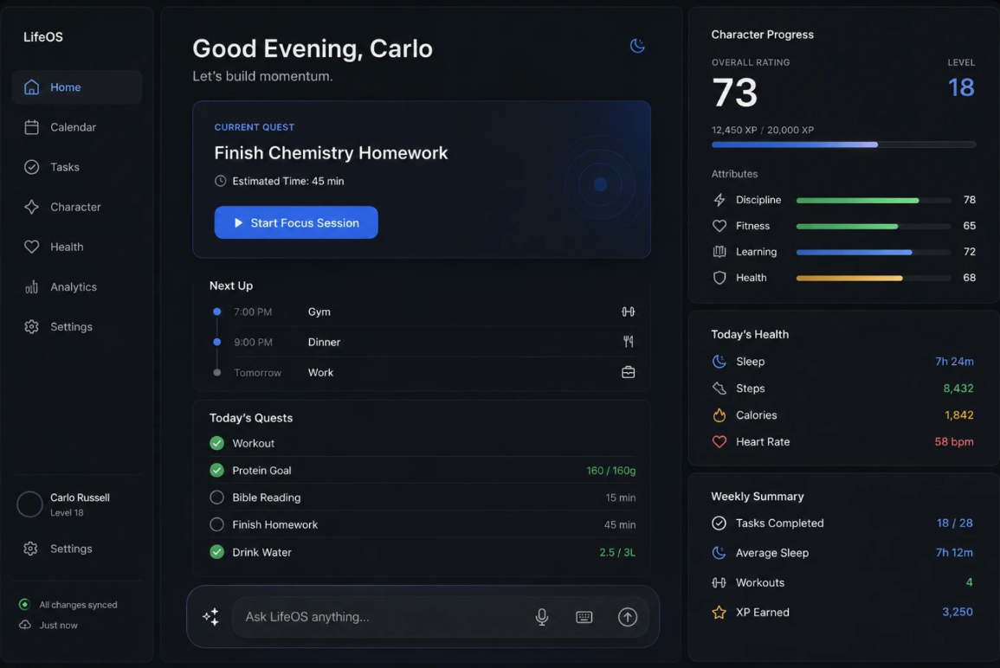
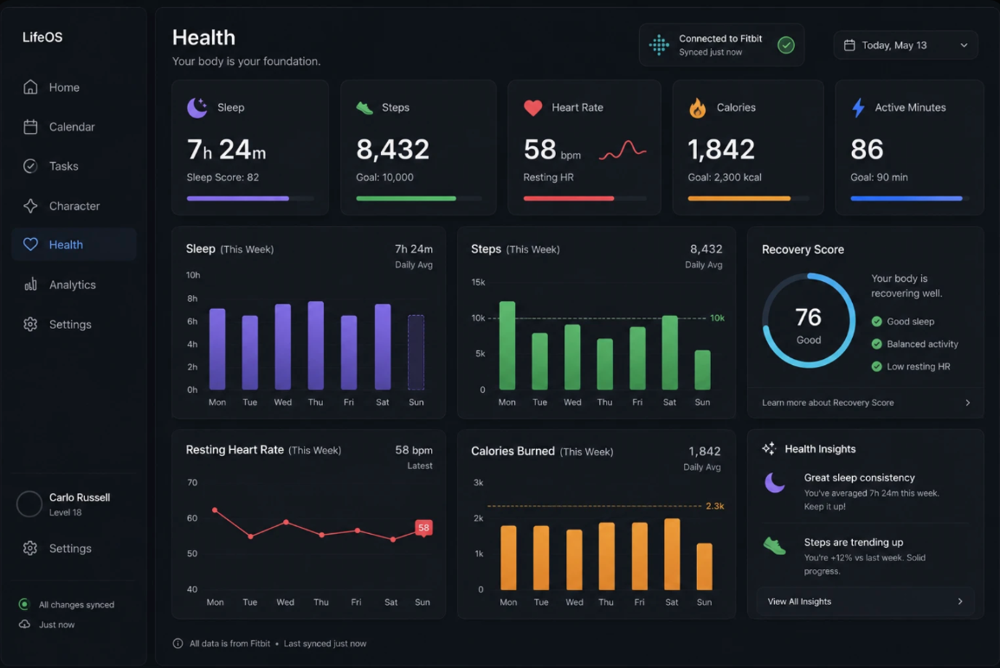
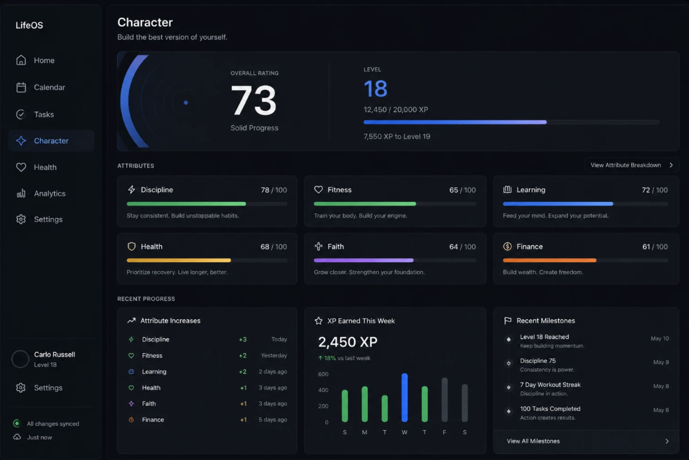
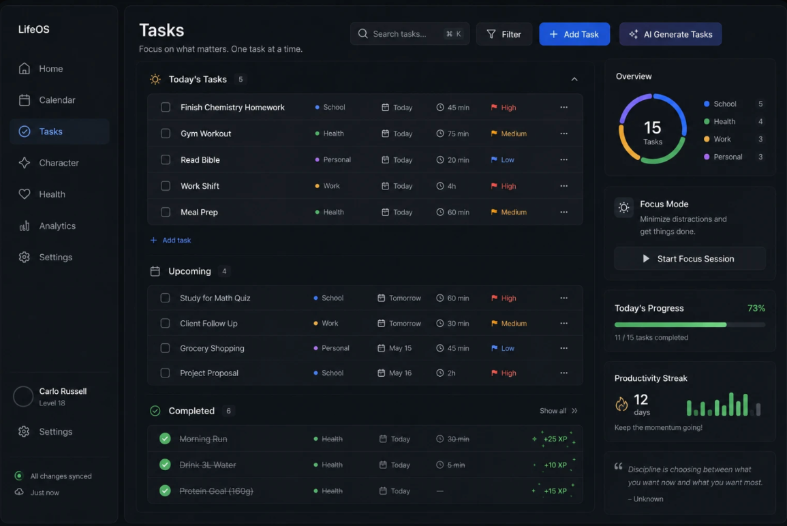
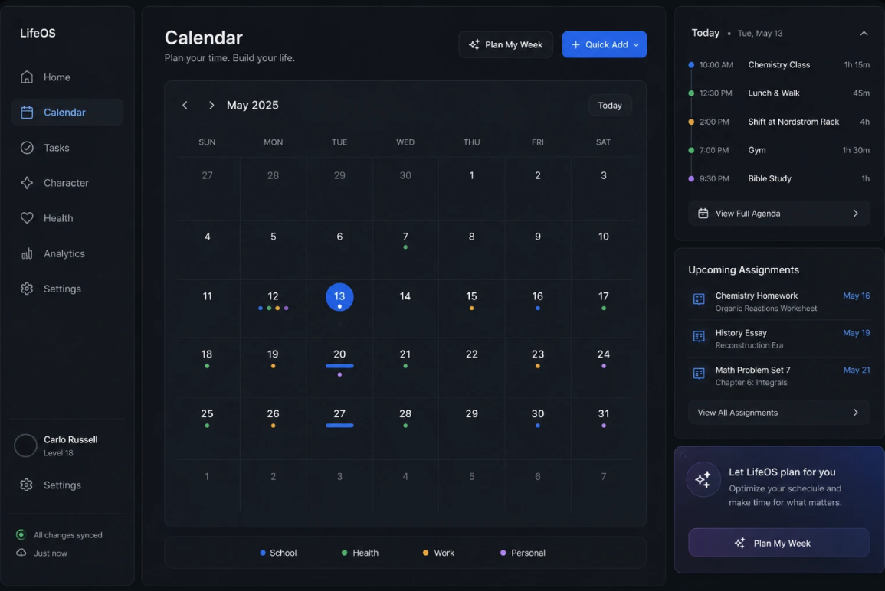
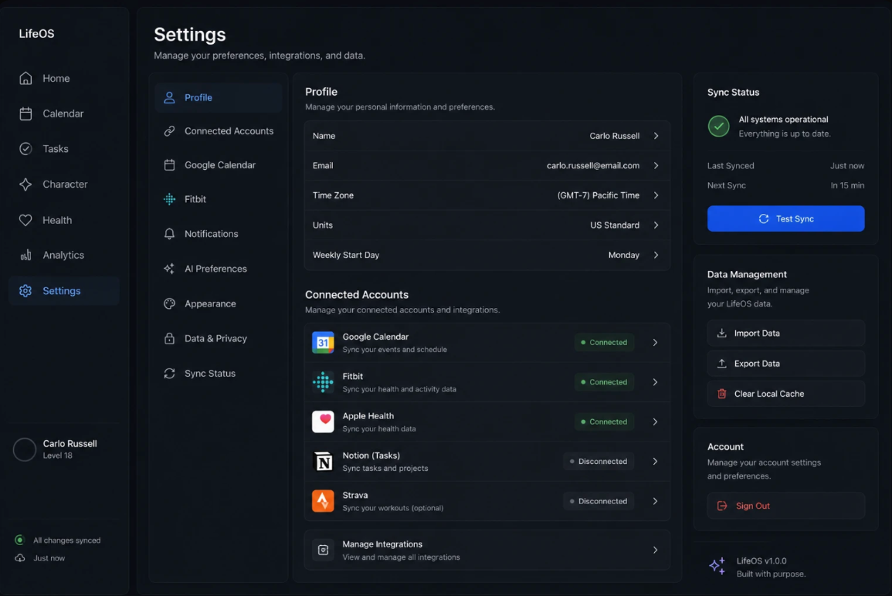
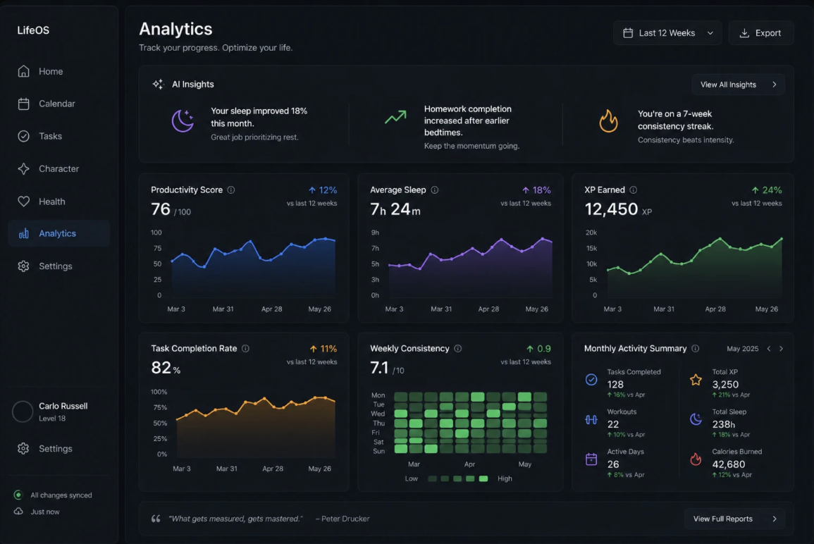

# LifeOS

LifeOS is a personal productivity and analytics platform that brings tasks, calendar events, health data, goals, and long-term performance insights into one system.

The project was created to solve a common problem: personal data is often spread across multiple apps, making it difficult to understand patterns, maintain consistency, and make informed decisions.

## Overview

LifeOS combines productivity tracking, health information, calendar planning, analytics, and gamified progression into a single dashboard.

The platform is designed to help users:

- Organize tasks and events
- Track productivity and consistency
- Review health and activity data
- Identify long-term behavioral trends
- Set goals and monitor progress
- Understand performance across multiple areas of life

## Key Features

- Google Calendar integration
- Task and schedule management
- Fitbit-connected health tracking
- Weekly and monthly analytics
- Productivity and consistency tracking
- XP, levels, achievements, and progression
- Personal goals and quests
- Sync and integration monitoring
- Dashboard-based performance insights
- Responsive desktop interface

## Project Screenshots

### Home Dashboard

### Health Dashboard

### Character Progress

### Tasks

### Calendar

### Settings

### Analytics

## Product Process

I managed the project from initial concept through development.

My responsibilities included:

- Defining the product vision
- Identifying user problems and needs
- Writing product requirements
- Prioritizing features and milestones
- Designing user workflows
- Reviewing usability and interface decisions
- Translating product requirements into technical tasks
- Testing features and resolving performance issues
- Using feedback and data to guide improvements

## Technology

- Next.js
- React
- TypeScript
- Prisma
- Supabase
- PostgreSQL
- Google Calendar API
- Fitbit API

## Architecture

LifeOS uses a Next.js application architecture with Prisma for database access and Supabase for authentication and data storage.

External integrations connect calendar and health data to the platform. Cached data loading, batched database queries, and synchronization monitoring are used to improve performance and reliability.

## Current Status

LifeOS is currently in active development.

Completed areas include:

- Calendar
- Tasks
- Home dashboard
- Health tracking
- Analytics
- Settings
- Character and progression system
- Integration sync monitoring

Some advanced features, including expanded AI-generated insights and additional integrations, are still in development.

## Future Development

Planned improvements include:

- Expanded AI insights
- Improved mobile responsiveness
- Financial tracking
- Meal and nutrition tracking
- Voice-based task creation
- Additional health integrations
- Improved long-term analytics
- Automated weekly reviews

## Relevant Certifications

- Google Business Intelligence Professional Certificate
- IBM Business Analyst Professional Certificate
- University of Virginia Digital Product Management Specialization

## Security and Privacy

Sensitive credentials, API keys, environment variables, and personal user data are not included in this repository.

Some integration code or configuration may be omitted for security and privacy reasons.

## Author

**Carlo Russell**

Business, product management, and business intelligence student interested in product strategy, analytics, e-commerce, and technology.
